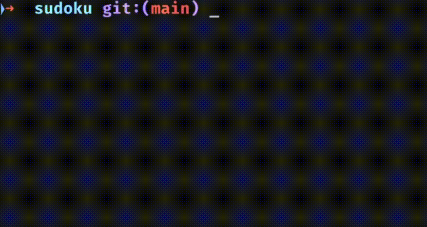

# Sudoku Solver

> [!NOTE]
> This repo contains a one-weekend project and will probably not be modified anymore

Small C Sudoku solver.

## Build and Run

Build with `make`:

```sh
mkdir -p build
make
```

Run the solver with a puzzle file:

```sh
./sudoku sudoku-1.txt
```

The program prints the starting grid, animates the solve, and exits with an
error if it cannot find a solution.

## Puzzle Format

Puzzle files are plain text descriptions of a 9x9 Sudoku grid.

- Use digits `1` through `9` for fixed starting values.
- Use `.` for empty cells.
- Whitespace and line breaks are ignored, so spaces and blank lines may be used for readability.
- The file should contain 81 meaningful cells total: digits or dots.

### Example:

```txt
6 8 .   4 . 9   . 1 3
. . .   1 . .   . . .
2 . .   5 . 8   4 7 6

. 2 .   3 . 5   . . 7
. . .   . 2 6   . 3 .
4 7 3   . . .   . . .

. 6 .   . . .   . . .
1 . .   . 5 .   3 . .
. . .   . . 7   . 9 1
```

## Demo

